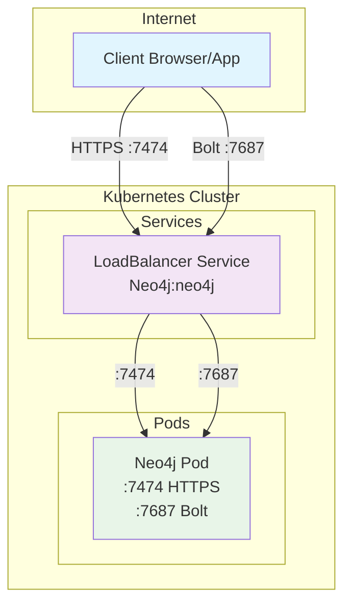
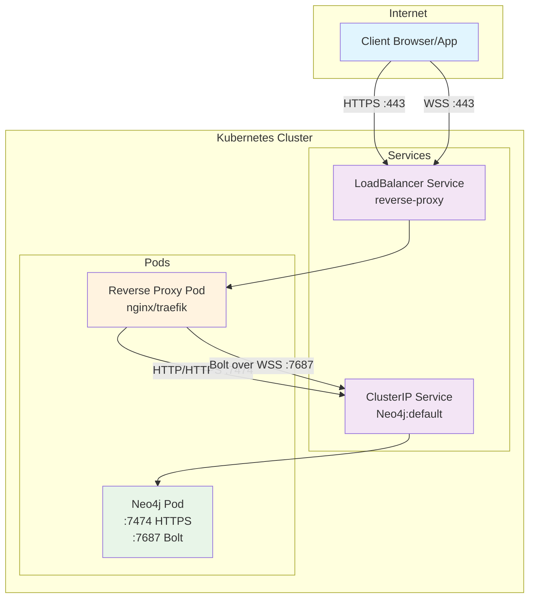
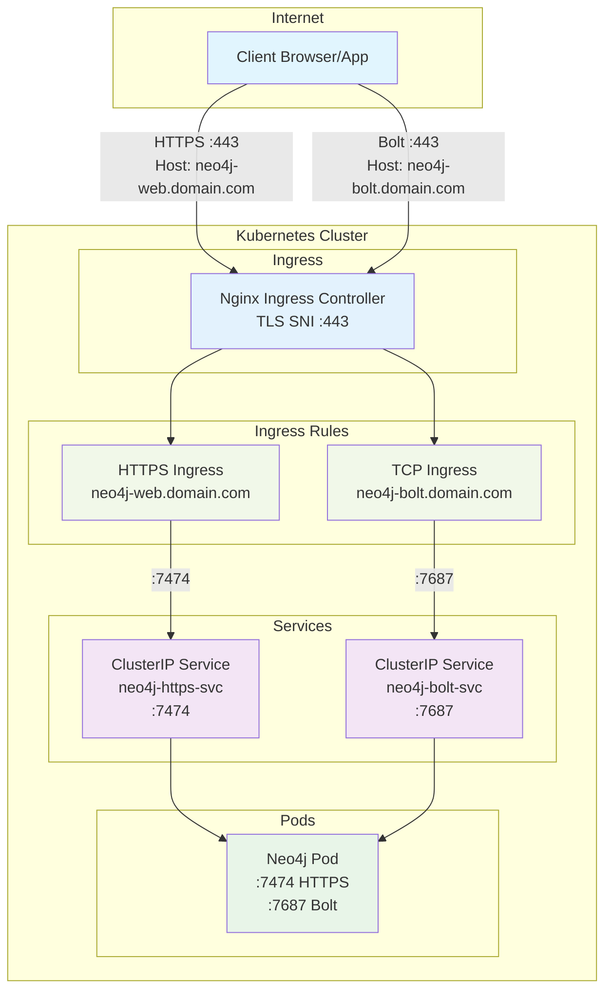
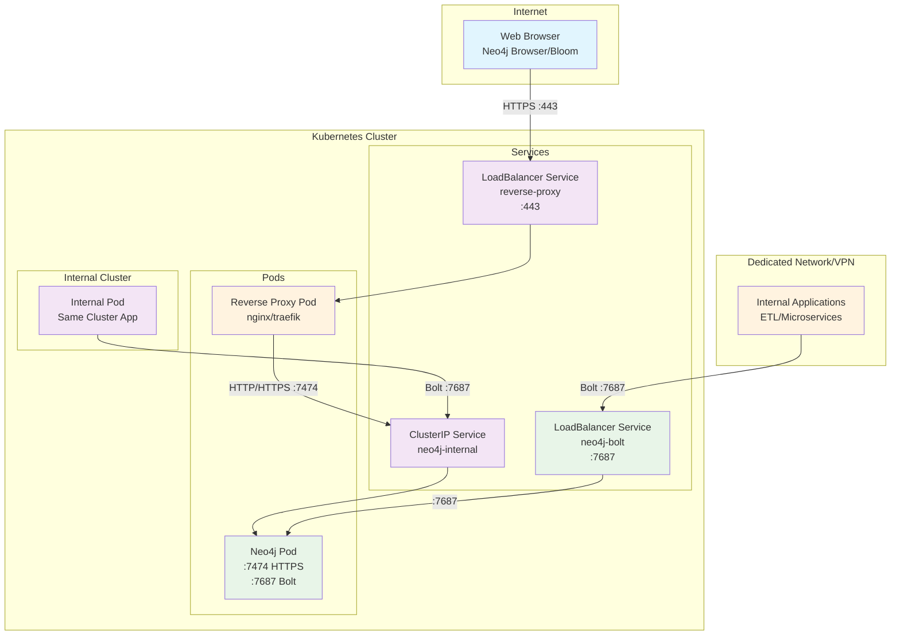

# Neo4j Kubernetes Configurations

This repository contains different configurations for deploying Neo4j on Kubernetes with multiple network approaches.

**Note:**
- HTTPS server and Bolt access are on the same pod but they also can be split

## 1. Simple Configuration - Direct Load Balancer

**Features:**

- Direct access to Neo4j ports via LoadBalancer service
- Port 7474 for HTTPS web interface
- Port 7687 for Bolt connections
- Simplest configuration

## 2. Reverse Proxy Configuration

**This works only for javascript driver which is the only one to support web socket and applications built on top of it : Neo4j Browser, Bloom, NeoDash.**

Other drivers and applications built on top of it (any ETL components) do not use wss but direct neo4j/bolt access.

**Features:**
- Reverse proxy for intelligent routing
- SSL termination at proxy level
- WebSocket Secure (WSS) for Bolt : 
- Neo4j service as ClusterIP (internal)

## 3. TLS SNI Configuration with Nginx Controller

We are using a single port (443) to access both HTTPS and Bolt. This is only possible with a Ingress Controller that support TLS SNI.

This also implies you can't set up this configuration without certificates and DNS.

**Features:**
- Ingress Controller with TLS SNI (example are with nginx)
- Host-based routing (SNI)
- Single port 443 for both services
- Separation of HTTPS and Bolt services

## 4. Hybrid Configuration - Reverse Proxy + Direct Bolt Access

**Best of both worlds: Web interface through reverse proxy for internet access, direct Bolt access for internal applications and dedicated networks.**

**This may be ideal if you want to provide access to Neo4j Browser, Bloom and Neodash through Internet, and need bolt port for ETL components or other applications/services using neo4j drivers.**

**Keep in mind database IS accessible through wss, so security is identity.**

**Features:**
- Reverse proxy for HTTPS web interface (internet access)
- Direct Bolt access via dedicated service for internal applications
- Support for all driver types (not limited to WebSocket)
- Ideal for ETL processes and internal microservices
- Clear separation between public web access and internal data access

**Use Cases:**
- **Web Interface**: Accessible from internet via reverse proxy (HTTPS only)
- **ETL Processes**: Direct Bolt access from dedicated network/VPN
- **Internal Services**: Direct cluster-internal access via ClusterIP
- **Monitoring Tools**: Can use either access method based on deployment location

## Approaches Comparison

| Aspect | Simple LB | Reverse Proxy | TLS SNI | Hybrid |
|--------|-----------|---------------|---------|---------|
| **Complexity** | Low | Medium | High | Medium-High |
| **External ports** | 2 (7474, 7687) | 1 (443) | 1 (443) | 2 (443, 7687) |
| **SSL/TLS** | Neo4j native | Proxy termination | Ingress termination | Mixed |
| **Routing** | Direct | Path/header based | SNI based | Mixed |
| **Scalability** | Limited | Good | Excellent | Excellent |
| **Driver support** | All | JS only (WSS) | All | All |
| **Use case** | Dev/Test | Web-only prod | Complex production | Enterprise production |

## Repository Structure

- `gke/` - Google Kubernetes Engine specific configurations
- `aks/` - Azure Kubernetes Service specific configurations
- `local/` - Local cluster configurations
- `neo4j/` - Custom Neo4j Helm charts