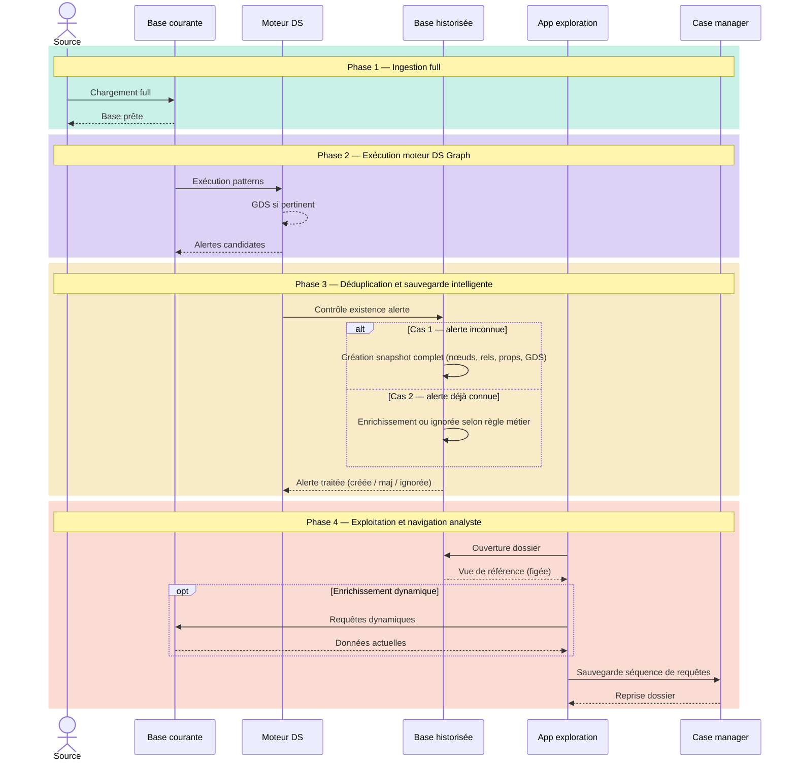

# Neo4j Kubernetes Deployment Architecture Guide

This repository provides several reference architectures for deploying Neo4j on Kubernetes.

Each topic is documented in detail in its dedicated guide:
- [Network Architecture](readme_network.md)
- [Storage & Data persistence](readme_volumes.md)
- [Plugin Management](readme_plugins.md)
- [Network Security (TLS/SSL)](readme_ssl.md)
- [Authentication & Authorization](readme_sso.md)

```mermaid

sequenceDiagram
    actor Source
    participant BC as Base courante
    participant DS as Moteur DS
    participant BH as Base historisée
    participant App as App exploration
    participant CM as Case manager

    rect rgb(200, 240, 230)
        note over Source,CM: Phase 1 — Ingestion full
        Source->>BC: Chargement full
        BC-->>Source: Base prête
    end

    rect rgb(220, 210, 245)
        note over Source,CM: Phase 2 — Exécution moteur DS Graph
        BC->>DS: Exécution patterns
        DS-->>DS: GDS si pertinent
        DS-->>BC: Alertes candidates
    end

    rect rgb(250, 235, 200)
        note over Source,CM: Phase 3 — Déduplication et sauvegarde intelligente
        DS->>BH: Contrôle existence alerte
        alt Cas 1 — alerte inconnue
            BH->>BH: Création snapshot complet (nœuds, rels, props, GDS)
        else Cas 2 — alerte déjà connue
            BH->>BH: Enrichissement ou ignorée selon règle métier
        end
        BH-->>DS: Alerte traitée (créée / maj / ignorée)
    end

    rect rgb(250, 220, 210)
        note over Source,CM: Phase 4 — Exploitation et navigation analyste
        App->>BH: Ouverture dossier
        BH-->>App: Vue de référence (figée)
        opt Enrichissement dynamique
            App->>BC: Requêtes dynamiques
            BC-->>App: Données actuelles
        end
        App->>CM: Sauvegarde séquence de requêtes
        CM-->>App: Reprise dossier
    end
```