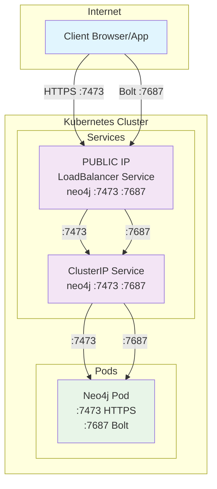
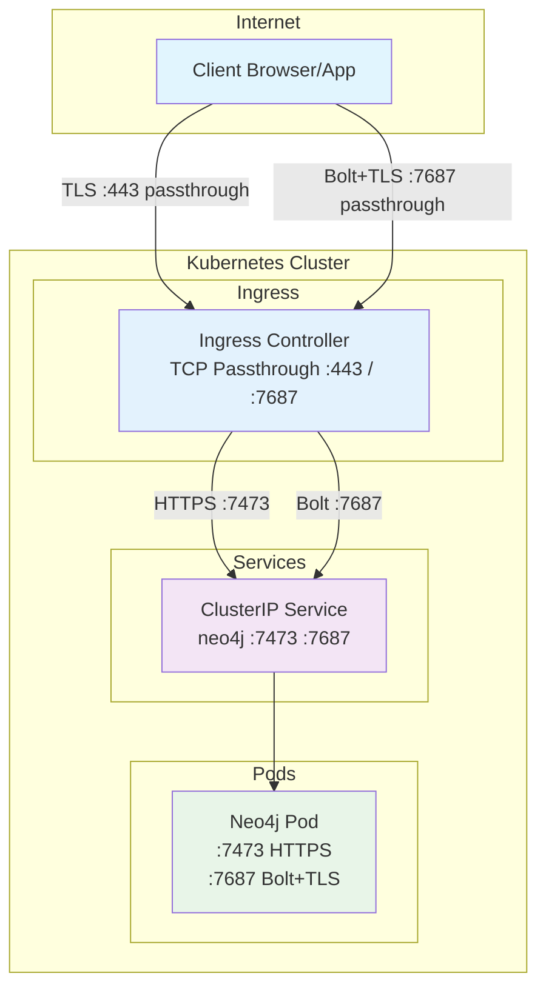
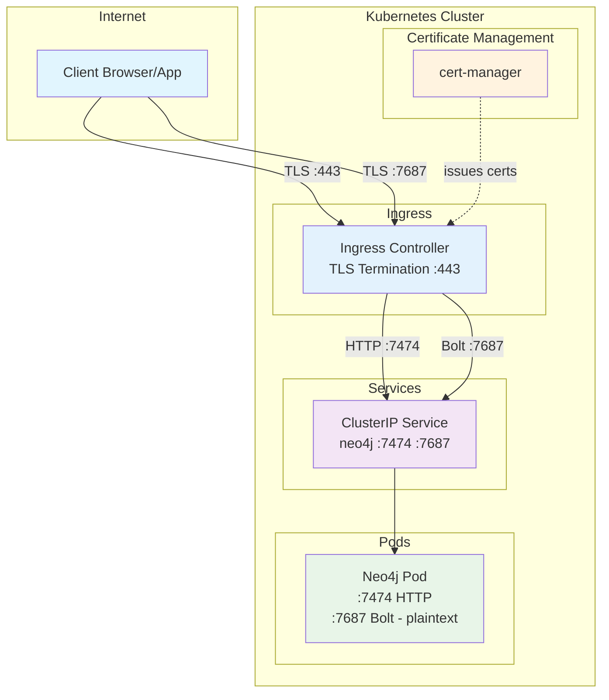
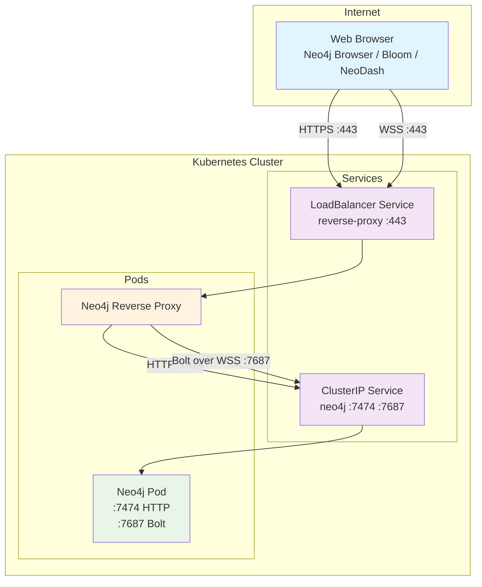
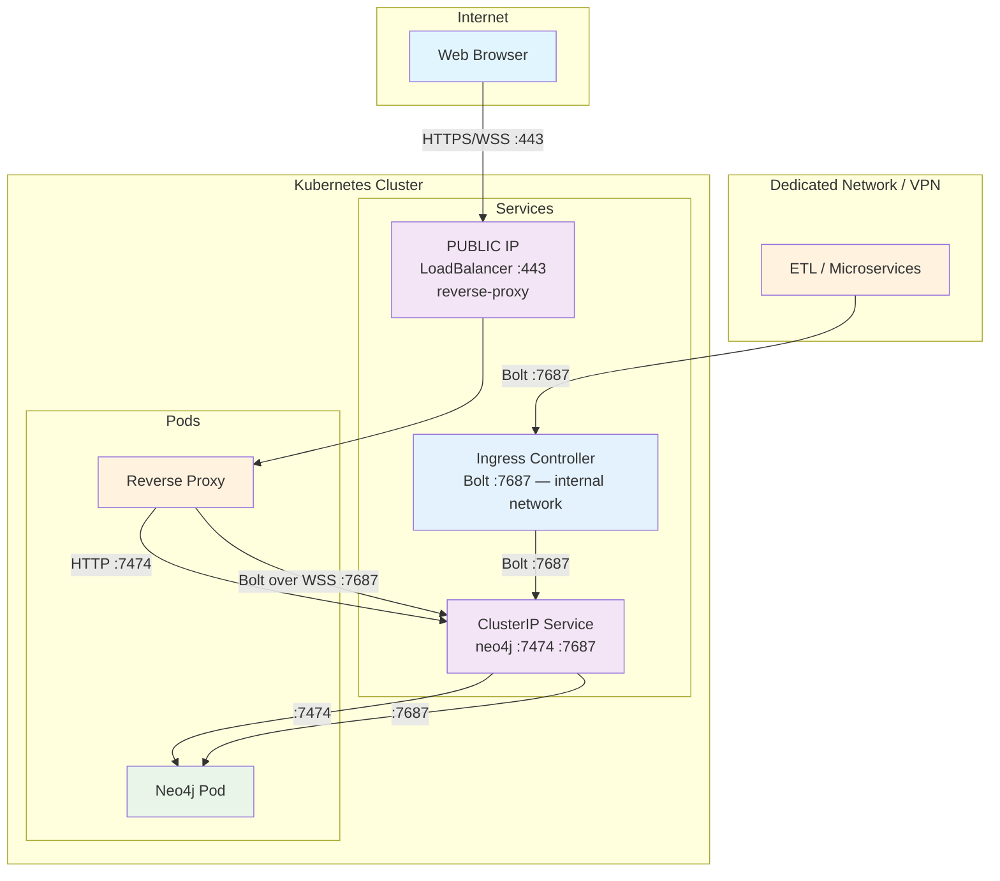
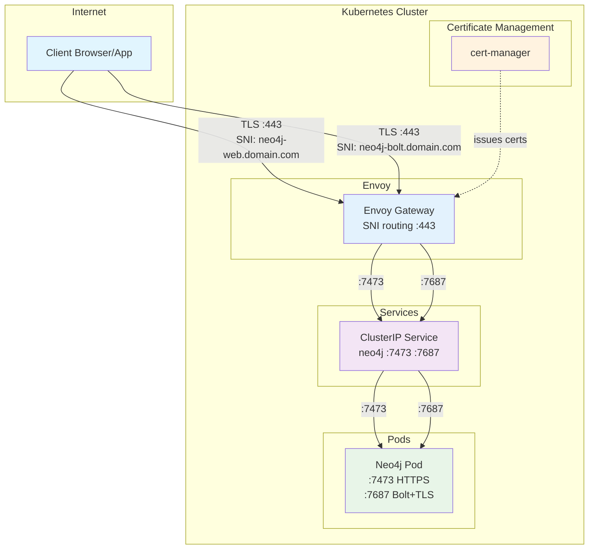

# Neo4j Kubernetes Network Architecture

## Choosing an Architecture

Exposing Neo4j on Kubernetes involves two independent problems: **HTTPS** (for Browser, Bloom, NeoDash, API) and **Bolt** (for drivers, ETL, microservices). Each can be solved separately, and the combination defines your architecture.

### 1 — HTTPS exposure

**Used by: Neo4j Browser, Bloom, NeoDash, REST API, and any HTTP-based client.**

| Method | Port | TLS handled by | WAF / L7 policies | Ingress requirement | Notes |
|---|---|---|---|---|---|
| **LoadBalancer** | 7473 | Neo4j | ❌ | N/A | Simplest setup; Neo4j directly exposed |
| **Ingress — TLS Passthrough** | 443 | Neo4j | ❌ | TLS passthrough | End-to-end encryption; certs managed by Neo4j |
| **Ingress — TLS Termination** | 443 | Ingress (cert-manager) | ✅ | HTTPS routing | Centralized cert management; recommended for most setups |
| **Reverse Proxy** | 443 | Proxy | ✅ | N/A | Single port; also handles Bolt over WSS (⚠️ JS driver only) |
| **Query API** | 443 | Ingress or Proxy | ✅ | HTTPS routing | ⚠️ Limited driver support; no Bolt needed |

### 2 — Bolt exposure

**Used by: Neo4j drivers (Python, Java, Go, .NET, JavaScript), ETL tools, and microservices.**

| Method | Port | TLS handled by | WAF / L7 policies | Ingress requirement | Clients | Notes |
|---|---|---|---|---|---|---|
| **LoadBalancer** | 7687 | Neo4j | ❌ | N/A | All drivers | Can be private/internal LB |
| **Ingress — TLS Passthrough** | 7687 | Neo4j | ❌ | TCP routing | All drivers | |
| **Ingress — TLS Termination** | 7687 | Ingress (cert-manager) | ✅ | TCP + TLS termination | All drivers | Not all ingress controllers support this |

> **Note:** Not all Ingress Controllers support TCP routing. If yours does not, consider either deploying a **second Ingress Controller** that supports TCP (e.g. Envoy Gateway, Traefik) dedicated to Bolt traffic, or using a **private LoadBalancer** for Bolt only — a simple and effective option when Bolt access is restricted to internal applications.

### Common combinations (= the architectures below)

| | HTTPS | Bolt | Notes |
|---|---|---|---|
| **A: LoadBalancer** | LoadBalancer :7473 | LoadBalancer :7687 | Simplest setup; Neo4j directly exposed |
| **B: Ingress Passthrough** | Ingress TLS Passthrough :443 | Ingress TLS Passthrough :7687 | End-to-end encryption; certs managed by Neo4j |
| **C: Ingress TLS Termination** | Ingress TLS Termination :443 | Ingress TLS Termination :7687 | Centralized certs via cert-manager; requires TCP-capable ingress |
| **D: Reverse Proxy** | Reverse Proxy :443 | Reverse Proxy WSS :443 | Single port 443; ⚠️ JS driver only for Bolt |
| **E: Ingress TLS + WSS** | Reverse Proxy :443 | Ingress TCP :7687 + Reverse Proxy WSS :443 | All drivers supported; higher complexity |

---

## Architecture A — LoadBalancer

The simplest way to get started. The Neo4j Helm chart creates a `LoadBalancer` service by default, which provisions a public IP directly to the Neo4j pod.

**Neo4j is directly reachable from the internet**. You can filter IP sources at the load balancer level.



**Helm values:**
```yaml
# Default helm behavior — no change needed for dev
neo4j:
  services:
    neo4j:
      type: LoadBalancer
```

**Pros:**
- Zero configuration, works out of the box
- All drivers supported (native Bolt, no WebSocket wrapping)

**Cons:**
- Neo4j exposed directly to the internet

---
## Architecture B — Ingress with TLS Passthrough

The Ingress forwards encrypted traffic as-is, without decrypting it. Neo4j handles TLS natively using its own certificates. This is a simpler alternative when you do not want to configure TCP termination at the Ingress level.



**Helm values:**
```yaml
neo4j:
  services:
    neo4j:
      type: ClusterIP

config:
  dbms.connector.https.enabled: "true"
  dbms.connector.bolt.tls_level: "REQUIRED"
  dbms.ssl.policy.bolt.enabled: "true"
  dbms.ssl.policy.https.enabled: "true"
```

**Pros:**
- End-to-end encryption — traffic is never decrypted outside the Neo4j pod
- Simpler Ingress configuration (no TCP termination needed)
- Neo4j remains autonomous regarding its own TLS stack
- Good fit for compliance requirements that mandate end-to-end encryption

**Cons:**
- Certificate management is done directly on Neo4j
- Certificate rotation must be handled per instance
- No possibility to apply WAF or L7 policies on Bolt traffic

--- 

## Architecture C — Ingress with TLS Termination

TLS is terminated at the Ingress Controller level. The Ingress decrypts traffic and forwards it in plaintext to Neo4j inside the cluster. Certificates are managed centrally via cert-manager.




**Helm values:**
```yaml
neo4j:
  services:
    neo4j:
      type: ClusterIP

# Neo4j listens in plaintext internally
config:
  dbms.connector.https.enabled: "false"
  dbms.connector.http.enabled: "true"
  dbms.connector.bolt.tls_level: "DISABLED"
```

**Important:** Most HTTP Ingress controllers handle HTTPS natively, but Bolt (TCP) requires explicit TCP routing configuration. With Envoy Gateway or Traefik, a `TCPRoute` or `IngressRouteTCP` resource is needed. See the [Bolt exposure table](#2--bolt-exposure) for alternatives if your Ingress Controller does not support TCP.

**Pros:**
- Centralized certificate management with cert-manager and automatic rotation
- Neo4j not exposed directly to the internet
- Single entry point for the entire cluster
- WAF, rate limiting, and access policies can be applied at Ingress level
- All driver types supported (native Bolt, not limited to WebSocket)

**Cons:**
- Requires explicit TCP routing configuration for Bolt (not just a standard Ingress rule)
- Traffic between Ingress and Neo4j is unencrypted — **acceptable only if the cluster network is trusted**

---

## Architecture D — Reverse Proxy (WSS only)

Neo4j reverse proxy sits in front of Neo4j and handles SSL termination. Bolt is exposed over WebSocket Secure (WSS) on port 443 (reverse proxy).

> ⚠️ **Critical limitation :** WSS is only supported by the **JavaScript driver** (and partially by Java Driver). This covers Neo4j Browser, Bloom, and NeoDash. All other drivers (Python, Java, Go, .NET) and ETL tools use native Bolt and **will not work** through a reverse proxy. If your use case includes any non-JS client, do not use this option alone — see the Hybrid option below.




**Pros:**
- Single port (443) for both HTTPS and Bolt
- Good for web-only access (Browser, Bloom, NeoDash)

**Cons:**
- Only works for the JavaScript driver (WSS)
- Native Bolt drivers (Python, Java, Go, .NET, ETL tools) are not supported
- Not suitable as the sole access method if non-JS clients exist

---

## Architecture E — Ingress TLS Termination + WSS

If you need web access via reverse proxy (WSS) *and* native Bolt for ETL or microservices, this architecture combines an Ingress Controller for Bolt with a Reverse Proxy for WebSocket traffic.

> ⚠️ **Critical limitation:**  Neo4j reverse proxy only redirects to unsecured HTTP and Bolt. This means you won't be able to enforce TLS REQUIRED at Neo4j level but only as OPTIONAL : Reverse proxy will be unsecured while clients can **choose** wether or not to enforce SSL.



**Pros:**
- All driver types supported (native Bolt via Ingress + WSS via Reverse Proxy)
- Web clients (Browser, Bloom, NeoDash) work through the reverse proxy
- ETL and microservices connect via native Bolt through the Ingress
- WAF and rate limiting can be applied at both Ingress and proxy level

**Cons:**
- Higher complexity — two ingress paths to manage
- Neo4j reverse proxy does not support TLS to Neo4j, so internal traffic from the proxy is unencrypted
- TLS REQUIRED cannot be enforced at Neo4j level (only OPTIONAL)

---

## Additional: TLS SNI with Envoy

A single port 443 serves both HTTPS and Bolt, with routing based on TLS SNI (Server Name Indication). Envoy inspects the SNI header of the TLS handshake — without decrypting the payload — and routes to the appropriate backend.

This requires DNS and valid certificates for both hostnames.



**Helm values:**
```yaml
neo4j:
  services:
    neo4j:
      type: ClusterIP

config:
  dbms.connector.https.enabled: "true"
  dbms.connector.bolt.tls_level: "REQUIRED"
  dbms.ssl.policy.bolt.enabled: "true"
  dbms.ssl.policy.https.enabled: "true"
```

**Pros:**
- Single port 443 (TCP) for all traffic
- All driver types supported (native Bolt, not limited to WebSocket)
- Fine-grained routing without decrypting payload
- cert-manager compatible
- Suitable for strict compliance environments (end-to-end encryption)

**Cons:**
- Requires DNS and valid certificates configured before deployment
- More complex to set up and operate than architectures B and C
- Envoy (or a SNI-capable Ingress) required — not all Ingress controllers support SNI-based TCP routing

---

## Client-side routing

In a Neo4j cluster, the driver can use [client-side routing](https://neo4j.com/docs/operations-manual/current/clustering/setup/routing/#clustering-client-side-routing) to discover and connect directly to individual cluster members. This requires each member to be reachable at its own address. Only the **Direct LoadBalancer** method supports this, since each Neo4j instance can be assigned its own external IP. All other methods (Ingress, Reverse Proxy, SNI) route traffic through a single entry point, making individual members unreachable from outside the cluster.

---

## Repository Structure

- `gke/` — Google Kubernetes Engine configurations
- `aks/` — Azure Kubernetes Service configurations  
- `local/` — Local cluster configurations (Docker Compose, kind, minikube)