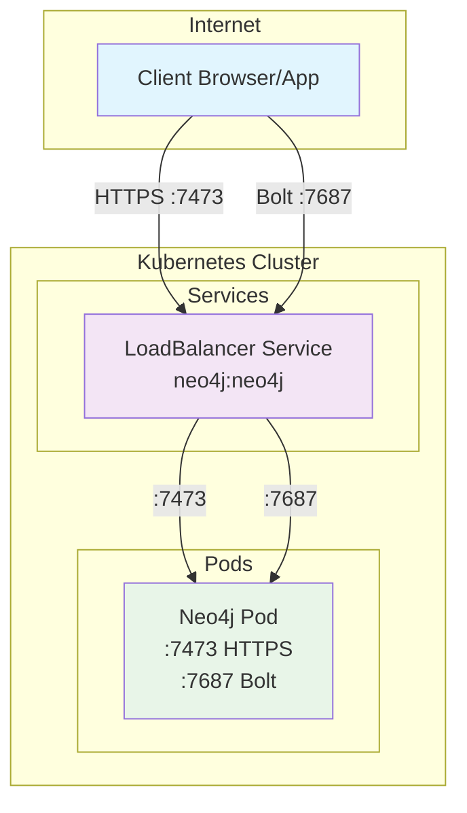
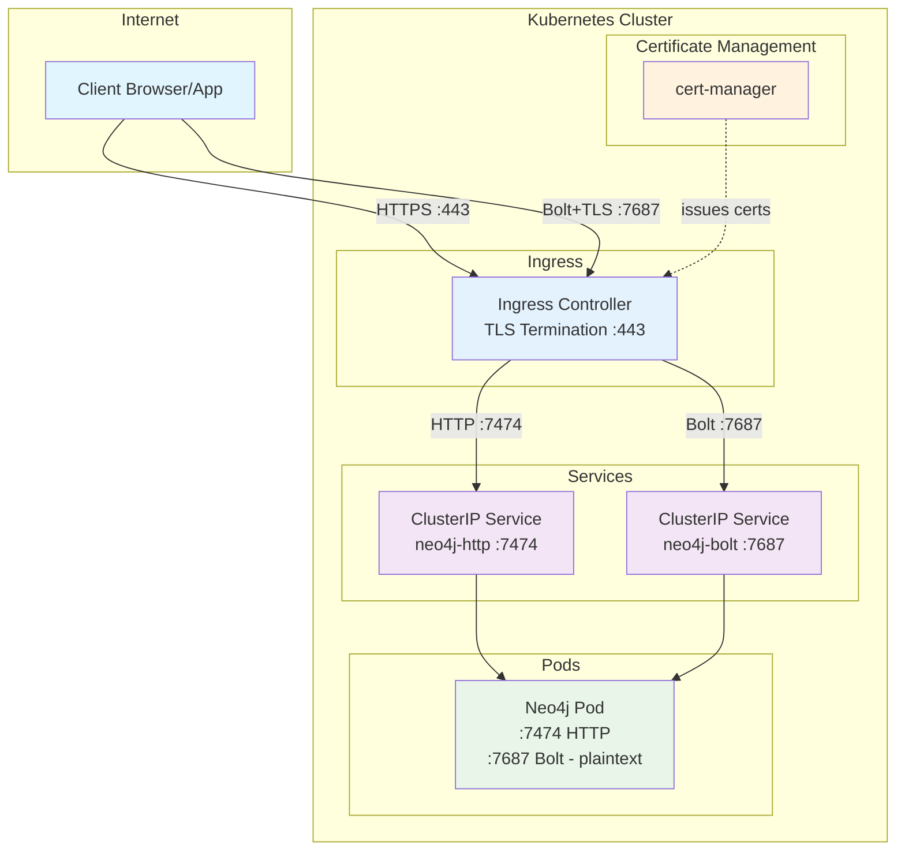
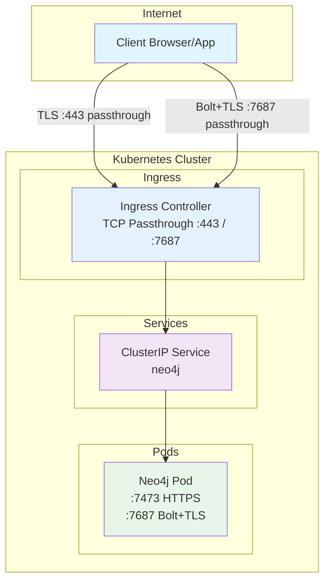
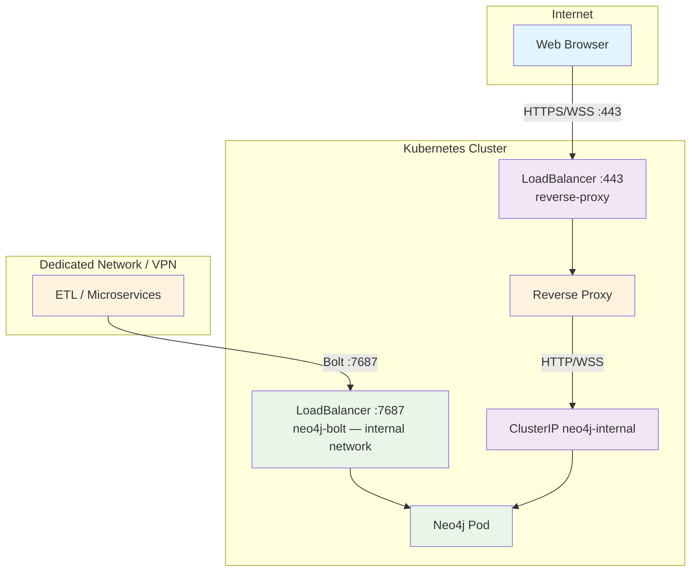
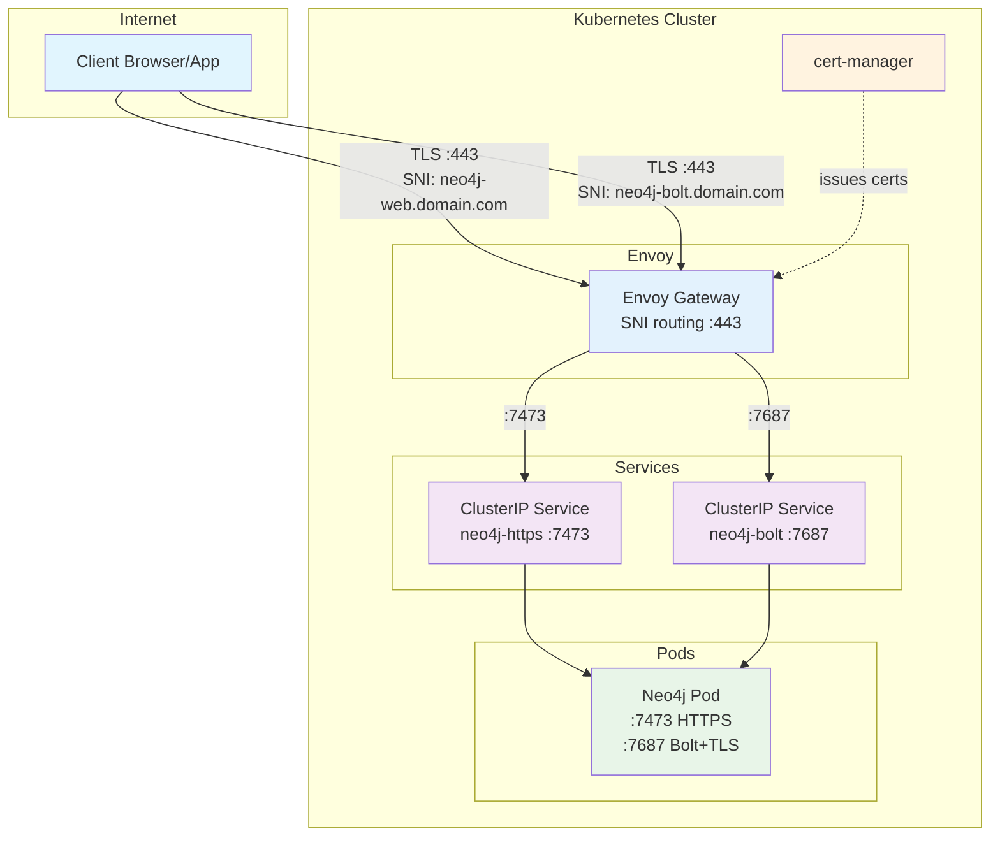

# Neo4j Kubernetes Network Architecture

> This document covers recommended network architectures for exposing Neo4j on Kubernetes, ordered from most to least recommended for production use.

---

## Quick Decision Guide

| | **Dev: Direct LB** | **Prod 1: Ingress TLS Termination** | **Prod 2: Ingress Passthrough** | **Prod 3: Reverse Proxy** | **Prod 4: TLS SNI (Envoy)** |
|---|---|---|---|---|---|
| **Complexity** | Low | Medium | Medium | Medium | High |
| **External ports** | 2 (7473, 7687) | 2 (443, 7687) | 2 (443, 7687) | 1 (443) | 1 (443) |
| **SSL/TLS location** | Neo4j native | Ingress | Neo4j native | Proxy | Ingress |
| **Driver support** | All | All | All | JS/WSS only | All |
| **Neo4j directly exposed** | ✅ Yes | ❌ No | ❌ No | ❌ No | ❌ No |
| **Bolt support** | ✅ | ✅ | ✅ | ⚠️ WSS only | ✅ |
| **WAF / Rate limiting** | ❌ | ✅ | ❌ | ✅ | ✅ |

---

## Development: Direct LoadBalancer

The simplest way to get started. The Neo4j Helm chart creates a `LoadBalancer` service by default, which provisions a public IP directly to the Neo4j pod. Suitable for development and testing only.

**Do not use in production** — Neo4j is directly reachable from the internet, there is no TLS offloading, no WAF, and no centralized certificate management.



**Helm values:**
```yaml
# Default helm behavior — no change needed for dev
neo4j:
  services:
    neo4j:
      type: LoadBalancer
```

**Pros:**
- Zero configuration, works out of the box
- All drivers supported (native Bolt, no WebSocket wrapping)

**Cons:**
- Neo4j exposed directly to the internet
- Not suitable for production

---

## Production Option 1 — Ingress with TLS Termination ✅ Recommended

TLS is terminated at the Ingress Controller level. The Ingress decrypts traffic and forwards it in plaintext to Neo4j inside the cluster. Certificates are managed centrally via cert-manager.

This is the **recommended approach** for most production deployments on Kubernetes, as it follows standard cloud-native practices and integrates well with the existing Ingress ecosystem.



**Helm values:**
```yaml
neo4j:
  services:
    neo4j:
      type: ClusterIP  # disable direct public exposure

# Neo4j listens in plaintext internally
config:
  dbms.connector.https.enabled: "false"
  dbms.connector.http.enabled: "true"
  dbms.connector.bolt.tls_level: "DISABLED"
```

**Important:** Most HTTP Ingress controllers handle HTTPS natively, but Bolt (TCP) requires explicit TCP routing configuration. With Envoy Gateway or Traefik, a `TCPRoute` or `IngressRouteTCP` resource is needed.

**Pros:**
- Centralized certificate management with cert-manager and automatic rotation
- Neo4j not exposed directly to the internet
- Single entry point for the entire cluster
- WAF, rate limiting, and access policies can be applied at Ingress level
- All driver types supported (native Bolt, not limited to WebSocket)

**Cons:**
- Requires explicit TCP routing configuration for Bolt (not just a standard Ingress rule)
- Traffic between Ingress and Neo4j is unencrypted — acceptable if the cluster network is trusted, but requires attention in multi-tenant environments

---

## Production Option 2 — Ingress with TLS Passthrough

The Ingress forwards encrypted traffic as-is, without decrypting it. Neo4j handles TLS natively using its own certificates. This is a simpler alternative when you do not want to configure TCP termination at the Ingress level.



**Helm values:**
```yaml
neo4j:
  services:
    neo4j:
      type: ClusterIP

config:
  dbms.connector.https.enabled: "true"
  dbms.connector.bolt.tls_level: "REQUIRED"
  dbms.ssl.policy.bolt.enabled: "true"
  dbms.ssl.policy.https.enabled: "true"
```

**Pros:**
- End-to-end encryption — traffic is never decrypted outside the Neo4j pod
- Simpler Ingress configuration (no TCP termination needed)
- Neo4j remains autonomous regarding its own TLS stack
- Good fit for compliance requirements that mandate end-to-end encryption

**Cons:**
- Certificate management is done directly on Neo4j
- Certificate rotation must be handled per instance
- No possibility to apply WAF or L7 policies on Bolt traffic

---

## Production Option 3 — Reverse Proxy (WSS only)

Neo4j reverse proxy sits in front of Neo4j and handles SSL termination. Bolt is exposed over WebSocket Secure (WSS) on port 443 (reverse proxy).

> ⚠️ **Critical limitation :** WSS is only supported by the **JavaScript driver**. This covers Neo4j Browser, Bloom, and NeoDash. All other drivers (Python, Java, Go, .NET) and ETL tools use native Bolt and **will not work** through a reverse proxy. If your use case includes any non-JS client, do not use this option alone — see the Hybrid option below.


**Pros:**
- Single port (443) for both HTTPS and Bolt
- Good for web-only access (Browser, Bloom, NeoDash)

**Cons:**
- Only works for the JavaScript driver (WSS)
- Native Bolt drivers (Python, Java, Go, .NET, ETL tools) are not supported
- Not suitable as the sole access method if non-JS clients exist

**Hybrid variant:** If you need web access via reverse proxy *and* native Bolt for ETL or microservices, expose a separate `LoadBalancer` service for Bolt on a dedicated network or VPN:

> ⚠️ **Critical limitation:**  Neo4j reverse proxy only redirects to unsecured HTTP and Bolt. This means you won't be able to enforce TLS REQUIRED at Neo4j level but only as OPTIONAL : Reverse proxy will be unsecured while clients can **choose** wether or not to enforce SSL.



---

## Production Option 4 — TLS SNI with Envoy

A single port 443 serves both HTTPS and Bolt, with routing based on TLS SNI (Server Name Indication). Envoy inspects the SNI header of the TLS handshake — without decrypting the payload — and routes to the appropriate backend.

This requires DNS and valid certificates for both hostnames.



**Helm values:**
```yaml
neo4j:
  services:
    neo4j:
      type: ClusterIP

config:
  dbms.connector.https.enabled: "true"
  dbms.connector.bolt.tls_level: "REQUIRED"
  dbms.ssl.policy.bolt.enabled: "true"
  dbms.ssl.policy.https.enabled: "true"
```

**Pros:**
- Single port 443 (TCP) for all traffic
- All driver types supported (native Bolt, not limited to WebSocket)
- Fine-grained routing without decrypting payload
- cert-manager compatible
- Suitable for strict compliance environments (end-to-end encryption)

**Cons:**
- Requires DNS and valid certificates configured before deployment
- More complex to set up and operate than options 1 and 2
- Envoy (or a SNI-capable Ingress) required — not all Ingress controllers support SNI-based TCP routing

---

## Repository Structure

- `gke/` — Google Kubernetes Engine configurations
- `aks/` — Azure Kubernetes Service configurations  
- `local/` — Local cluster configurations (Docker Compose, kind, minikube)