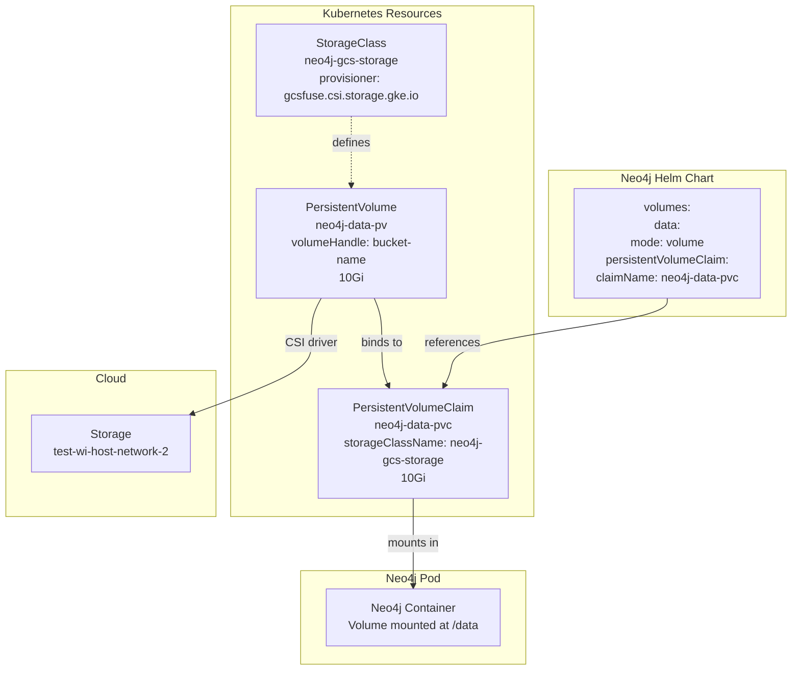

# Volumes Configurations

### Default Behavior

By default, Neo4j Helm chart:
- Creates ONE persistent volume for `data`
- Transaction logs are stored in `/data/transactions` (same volume as data)
- All other volumes **share** the same `data` volume (mode: share)
- Only `data` volume requires configuration

## Neo4j Volumes

Neo4j uses multiple volume mounts for different purposes. Understanding their performance requirements is crucial for optimal deployment.

| Volume Mount | Default Path | Purpose | Performance Criticality | Storage Type Recommendation | Can Share with data? |
|--------------|--------------|---------|------------------------|----------------------------|---------------------|
| **data** | `/data` | Database store files (nodes, relationships, properties) | **Critical** Highest IOPS required | SSD/NVMe (premium-rwo, pd-ssd) NOT GCS/NFS | N/A |
| **transactions** | `/data/transactions` | Transaction logs (write-ahead logs) | **Critical** High sequential write IOPS | SSD/NVMe Can separate from data for better performance | Yes (but recommended to separate) |
| **logs** | `/logs` | Neo4j logs (neo4j.log, debug.log) | **Medium** Frequent writes during operations | SSD recommended Can use HDD for cost | Yes (default) |
| **metrics** | `/metrics` | Prometheus metrics (Enterprise only) | **Medium** Regular metric writes | SSD recommended Can use HDD | Yes |
| **import** | `/import` | CSV/data files for LOAD CSV and import | **Low** Sequential reads | HDD acceptable GCS/NFS acceptable | Yes |
| **plugins** | `/plugins` | JAR files for APOC, Graph Data Science, etc. | **Low** Read at startup only | Any storage type Can use ConfigMap | Yes |
| **licenses** | `/licenses` | Enterprise license files | **Low** Read at startup only | Any storage type Can use Secret | Yes |
| **backups** | `/backups` | Database backup files | **Low** Sequential writes during backup | HDD acceptable GCS recommended for cost | No |

## Storage Architecture Overview

## Components Explanation

| Component | Purpose |
|-----------|---------|
| **StorageClass** | Defines storage type and provisioner, can be disk or bucket |
| **PersistentVolume (PV)** | Represents physical storage (GCS bucket) |
| **PersistentVolumeClaim (PVC)** | Requests storage for use |
| **Neo4j Pod** | Uses PVC to access storage | Helm chart |

## Storage Solutions Comparison

| Solution | Description | What You Create | What Neo4j/K8s Creates | Pros | Cons | Use Case |
|----------|-------------|-----------------|------------------------|------|------|----------|
| **1. Default Dynamic** | Use default StorageClass | Nothing | PVC + PV (via default SC) | - Fastest setup - No prerequisites - Zero configuration | - Default retention (Delete) - Less control - Uses cluster defaults | Quick start, testing |
| **2. Custom StorageClass + Dynamic** | Custom StorageClass with retention policy | StorageClass | PVC + PV (via custom SC) | - Custom retention policy - Production-ready - SSD/performance control - Volume expansion | - Need to create StorageClass - One extra resource | Production with custom retention |
| **3. neo4j-persistent-volume Chart** | Use Neo4j's helper chart | Nothing (chart does it) | PV + StorageClass (via chart), PVC (via Neo4j) | - Simplified manual provisioning - Neo4j best practices - Disk pre-allocation | - Extra Helm chart to manage - Less flexibility - Learning curve | Simplified manual provisioning |
| **4. Manual PV + PVC** | Full manual control | StorageClass + PV + PVC | Nothing | - Maximum control - Custom storage backends (GCS, NFS) - Identity management (Workload Identity) - Specific bucket/disk | - Most manual work - Need to understand all components - More maintenance | Maximum control, GCS/NFS, Workload Identity |
| **5. Selector Mode** | Pre-provision PV with labels | StorageClass + PV (with labels) | PVC (matches selector) | - Pre-allocated storage - Multi-tenant support - Label-based selection - Team/project isolation | - Complex setup - Manual PV creation - Label management - no-provisioner only | Multi-tenant, pre-allocated storage |

## Google volumes 

### GKE Storage Classes Performance Comparison

| Storage Class | Type | Provisioner | Read IOPS (3K) | Write IOPS (3K) | Max IOPS | Throughput | Latency | Use Case | Cost |
|---------------|------|-------------|----------------|-----------------|----------|------------|---------|----------|------|
| **standard-rwo** | HDD (Balanced PD) | pd.csi.storage.gke.io | 0.75 per GB | 1.5 per GB | 15,000 | 240 MB/s | ~10ms | Logs, backups | $ |
| **premium-rwo** | SSD (SSD PD) | pd.csi.storage.gke.io | 30 per GB | 30 per GB | 100,000 | 1,200 MB/s | ~1ms | **Neo4j data** (recommended) | $$$ |
| **standard** | HDD (Standard PD - deprecated) | kubernetes.io/gce-pd | 0.75 per GB | 1.5 per GB | 7,500 | 180 MB/s | ~10ms | Legacy | $ |
| **GCS Bucket (gcsfuse)** | Object Storage | gcsfuse.csi.storage.gke.io | N/A | N/A | ~5,000 ops/s | ~500 MB/s | ~50-100ms | **Import only** | $ |

**Notes:**
- IOPS scale with volume size (shown per GB)
- Max IOPS requires sufficient volume size (e.g., premium-rwo needs 334GB for 10K IOPS)
- GCS is object storage, not block storage - IOPS concept doesn't apply the same way

### Performance Examples

| Volume Size | standard-rwo IOPS | premium-rwo IOPS | Suitable for Neo4j data? |
|-------------|-------------------|------------------|--------------------------|
| 10 GB | 7.5 / 15 | 300 / 300 | No / No |
| 100 GB | 75 / 150 | 3,000 / 3,000 | No / Yes (small workloads) |
| 500 GB | 375 / 750 | 15,000 / 15,000 | No / Yes |
| 1 TB | 750 / 1,500 | 30,000 / 30,000 | No / Yes (optimal) |
| 10 TB | 7,500 / 15,000 (max) | 100,000 / 100,000 (max) | No / Yes (high performance) |

### Recommendations by Volume Type

| Neo4j Volume | Recommended Storage | StorageClass | Reason |
|--------------|---------------------|--------------|--------|
| **data** | SSD Persistent Disk | `premium-rwo` | Critical IOPS requirements, low latency |
| **transactions** | SSD Persistent Disk | `premium-rwo` (separate) | High write IOPS, sequential writes |
| **logs** | SSD or HDD | `premium-rwo` or `standard-rwo` | Medium write frequency |
| **import** | GCS Bucket | `gcsfuse.csi.storage.gke.io` | Sequential reads, cost-effective, large files |
| **backups** | GCS Bucket | `gcsfuse.csi.storage.gke.io` | Sequential writes, long-term storage, low cost |
| **plugins/licenses** | Any | `standard-rwo` or ConfigMap/Secret | Read at startup only |

## Sources

https://neo4j.com/docs/operations-manual/current/kubernetes/persistent-volumes/#volume-mounts

https://github.com/neo4j/helm-charts/tree/dev 